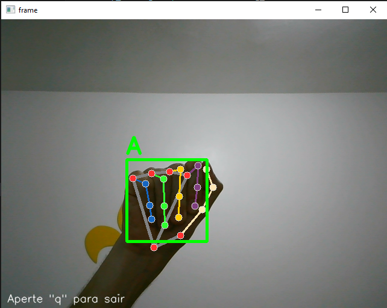

---

```markdown
# Leitor de Libras com Reconhecimento de Gestos em Tempo Real

Este projeto tem como objetivo detectar e traduzir gestos da Língua Brasileira de Sinais (LIBRAS) para texto, reconhecendo letras isoladas em tempo real a partir de capturas de vídeo via webcam. O sistema utiliza landmarks das mãos para identificar sinais e exibir a letra correspondente diretamente na tela.

## Índice
- [Descrição Geral](#descrição-geral)
- [Tecnologias Utilizadas](#tecnologias-utilizadas)
- [Como Funciona](#como-funciona)
- [Execução do Projeto](#execução-do-projeto)
- [Estrutura do Projeto](#estrutura-do-projeto)
- [Exemplo Visual](#exemplo-visual)
- [Dependências e Instalação](#dependências-e-instalação)

---

## Descrição Geral

Este sistema de leitura de LIBRAS funciona em tempo real utilizando a webcam. Um modelo de rede neural densa (MLP) foi treinado do zero para classificar gestos de letras do alfabeto com base nas posições das mãos, capturadas por meio da biblioteca **MediaPipe**. O modelo classifica os gestos e retorna uma letra correspondente.

---

## Tecnologias Utilizadas

- [MediaPipe](https://developers.google.com/mediapipe): Para rastreamento das mãos e extração de landmarks.
- [OpenCV](https://opencv.org/): Para captura e exibição das imagens da webcam.
- [NumPy](https://numpy.org/): Manipulação numérica dos dados.
- [Pickle](https://docs.python.org/3/library/pickle.html): Salvamento e carregamento do modelo treinado.
- [tqdm](https://tqdm.github.io/): Barra de progresso usada na criação do dataset.

---

## Como Funciona

1. A webcam captura o vídeo em tempo real.
2. O MediaPipe extrai os pontos de referência (landmarks) da mão.
3. Esses pontos são usados como entrada para o modelo MLP treinado.
4. O modelo prediz uma letra do alfabeto correspondente ao gesto.
5. A letra é exibida diretamente na tela, sobre o vídeo.

---

## Execução do Projeto

### Pré-requisitos

Crie um ambiente virtual (opcional) e instale as dependências com o comando:

```bash
pip install -r requirements.txt
```

### Rodando o projeto

No terminal, execute o script principal:

```bash
python main.py
```

Ao executar, a webcam será ativada e as letras reconhecidas serão exibidas na tela.

---


## Exemplo Visual

Abaixo, um exemplo do sistema em funcionamento:



> O gesto da mão foi reconhecido como a letra **A**.

---

## Dependências e Instalação

As principais bibliotecas utilizadas estão listadas no arquivo `requirements.txt`. Para instalar todas elas:

```bash
pip install -r requirements.txt
```

Em caso de problemas com ambientes virtuais, considere usar o [Conda](https://docs.conda.io/en/latest/) ou recriar o ambiente com o Python compatível.

---

**⚠️ Observação:**  
O projeto não depende das imagens originais capturadas, apenas dos arquivos `.model` e `.pkl` com os dados e o modelo já treinado. Por isso, imagens brutas não estão incluídas no repositório.

---

⚠️ **Limitação atual:**  
O modelo reconhece apenas letras que não envolvem movimentos, ou seja, **A, B, C, D, E, F, G, I, L, M, N, O, P, Q, R, S, T, U, V, W, Y**.  
Letras que requerem **movimento dinâmico** como **H, J, K, X, Z** ainda **não estão implementadas**, pois exigem análise temporal (sequência de frames) e tratamento mais avançado com séries temporais ou modelos baseados em vídeo.

---

📌 *Este projeto é uma demonstração de um sistema simples de reconhecimento de sinais em LIBRAS, útil como base para sistemas mais complexos de tradução de linguagem de sinais para texto ou fala.*

---